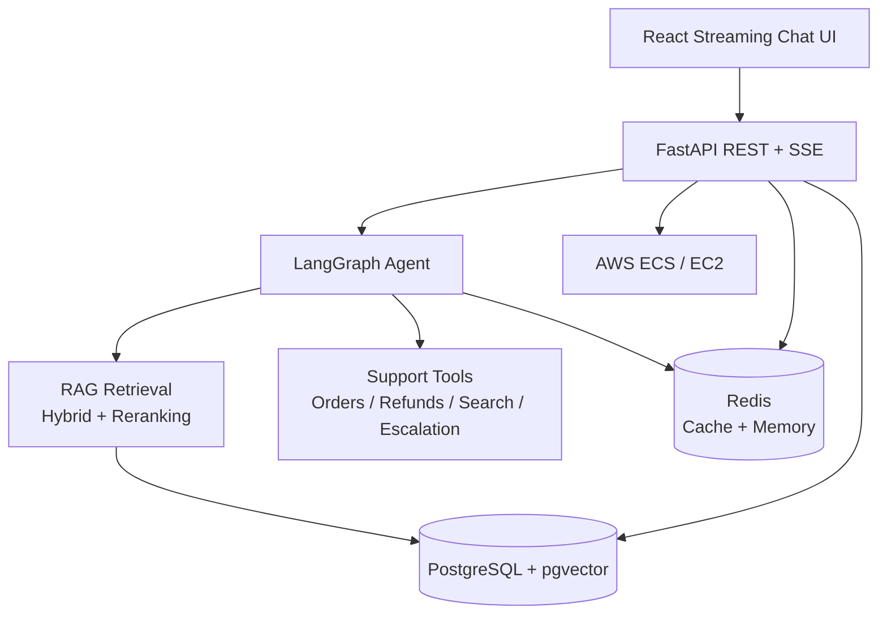

# 🤖 Enterprise AI Support & Knowledge Agent

[](https://github.com/AloneRider-pixel/enterprise-ai-agent/actions/workflows/ci.yml)
[](LICENSE)

**Enterprise support agent combining RAG, tool calling, conversation memory, streaming APIs, and safety controls.**

> **Portfolio focus:** Python + FastAPI + LangGraph + RAG + pgvector + Redis + React + production-style AI controls.

## Architecture



## Core capabilities

### RAG pipeline
- PDF, TXT, and DOCX ingestion.
- Recursive chunking with overlap preservation.
- OpenAI embeddings stored in pgvector.
- Hybrid vector + BM25 retrieval.
- Cross-encoder reranking.
- Source citation tracking for generated responses.

### Agent workflows
- Tool/function calling for order lookup, refund, web search, and human escalation.
- Redis-backed conversation memory.
- Multi-turn workflows implemented with LangGraph.
- SSE streaming for interactive responses.

### Security and safety
- JWT authentication and role-based access.
- Redis-backed rate limiting.
- Prompt-injection detection.
- Hallucination/faithfulness checks.
- Input validation and explicit CORS configuration.

### Observability and evaluation
- Structured JSON logging.
- Request latency and token/cost tracking.
- Evaluation of faithfulness, relevance, recall, and precision.
- Automated CI for linting and testing.

## Technology stack

| Layer | Technology |
|---|---|
| Backend | Python 3.11, FastAPI |
| AI | LangGraph, LangChain, OpenAI |
| Retrieval | pgvector, BM25, cross-encoder reranking |
| Database | PostgreSQL 16 |
| Cache / memory | Redis 7 |
| Frontend | React 18, Vite, TailwindCSS |
| Auth | JWT, PyJWT |
| Infrastructure | Docker, AWS, GitHub Actions |

## Repository structure

```text
enterprise-ai-agent/
├── backend/
│   ├── app/
│   │   ├── agents/
│   │   ├── rag/
│   │   ├── api/
│   │   ├── auth/
│   │   ├── middleware/
│   │   └── services/
│   └── tests/
├── frontend/
│   └── src/
├── evaluation/
├── scripts/
├── .github/workflows/ci.yml
├── docker-compose.yml
└── README.md
```

## Local development

### Prerequisites

- Docker + Docker Compose
- OpenAI API key

### Start

```bash
git clone https://github.com/AloneRider-pixel/enterprise-ai-agent.git
cd enterprise-ai-agent
cp .env.example .env
docker-compose up --build
```

Services:

- Backend: `http://localhost:8000`
- Frontend: `http://localhost:3000`
- PostgreSQL: `localhost:5432`
- Redis: `localhost:6379`

### Initialize demo data

```bash
docker-compose exec backend python -m app.scripts.create_admin
docker-compose exec backend python -m scripts.seed_documents
```

## API surface

| Method | Endpoint | Purpose |
|---|---|---|
| POST | `/api/auth/register` | Register a user |
| POST | `/api/auth/login` | Obtain JWT |
| GET | `/api/auth/me` | Current user |
| POST | `/api/chat` | Streaming chat |
| GET | `/api/chat/history/{session_id}` | Conversation history |
| POST | `/api/documents/upload` | Upload document |
| POST | `/api/documents/ingest/{id}` | Trigger ingestion |
| POST | `/api/evaluation/run` | Run evaluation suite |

## Evaluation

The project includes evaluation hooks for faithfulness, answer relevance, context recall, context precision, latency, and cost. Results should be reported with the evaluation dataset and methodology used.

## Performance targets

These values are **design targets**, not measured production guarantees:

| Metric | Target |
|---|---:|
| P50 latency | `< 2s` |
| P95 latency | `< 5s` |
| Faithfulness | `> 0.85` |
| Context recall | `> 0.80` |
| Hallucination rate | `< 5%` |

## Security

- Passwords hashed with bcrypt.
- JWT tokens with configurable expiry.
- Per-user rate limiting.
- Prompt-injection detection.
- Input validation and configurable CORS.
- Runtime secrets supplied through environment variables.

## Roadmap

- Stronger structured output validation for tool calls.
- OpenTelemetry traces and metrics.
- Persistent evaluation history.
- Human-in-the-loop review console.
- Production deployment examples with least-privilege AWS IAM.

## License

MIT
