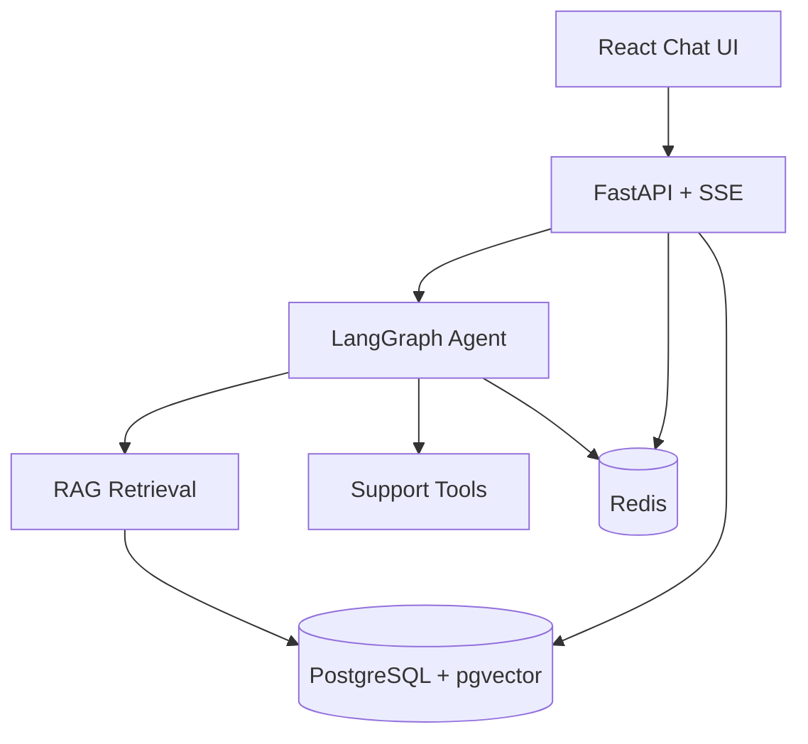

# 🤖 Enterprise AI Support & Knowledge Agent

[](https://github.com/AloneRider-pixel/enterprise-ai-agent/actions/workflows/ci.yml)
[](https://github.com/AloneRider-pixel/enterprise-ai-agent/actions/workflows/codeql.yml)
[](LICENSE)

Production-oriented enterprise support agent combining RAG, LangGraph workflows, tool calling, conversation memory, streaming APIs, and explicit safety controls.

## What it demonstrates

- **Grounded RAG:** PDF/TXT/DOCX ingestion, embeddings, hybrid retrieval, reranking, and source citations.
- **Agent workflows:** LangGraph orchestration with support tools, escalation paths, and multi-turn memory.
- **Security boundaries:** JWT/RBAC, rate limiting, prompt-injection defenses, bounded uploads, and user-owned document/session access.
- **Evaluation:** faithfulness, relevance, recall, precision, latency, and cost instrumentation.
- **Delivery:** Dockerized services plus GitHub Actions CI, CodeQL, dependency review, and Scorecard.

## Architecture


```mermaid
graph TB
    UI[React Chat UI] --> API[FastAPI + SSE]
    API --> AGENT[LangGraph Agent]
    AGENT --> RAG[RAG Retrieval]
    AGENT --> TOOLS[Support Tools]
    RAG --> PG[(PostgreSQL + pgvector)]
    AGENT --> REDIS[(Redis)]
    API --> PG
    API --> REDIS
```

## Stack

| Layer | Technology |
|---|---|
| Backend | Python 3.11, FastAPI, SQLAlchemy |
| AI | LangGraph, LangChain, OpenAI |
| Retrieval | pgvector, BM25, cross-encoder reranking |
| Data | PostgreSQL 16, Redis 7 |
| Frontend | React 18, Vite, TailwindCSS |
| Auth | JWT / PyJWT |
| Delivery | Docker, GitHub Actions, AWS |

## Repository layout

```text
backend/
  app/
    agents/        # Agent graphs, nodes, tools
    api/           # HTTP endpoints
    auth/          # Authentication / authorization
    middleware/    # Injection, logging, rate limiting
    rag/           # Retrieval and generation
    services/      # Cost and hallucination services
  tests/
frontend/
evaluation/
scripts/
docs/
.github/workflows/
```

## Quick start

Prerequisites: Docker Compose and an OpenAI API key.

```bash
git clone https://github.com/AloneRider-pixel/enterprise-ai-agent.git
cd enterprise-ai-agent
cp .env.example .env
docker compose up --build
```

Default local endpoints:

- Frontend: `http://localhost:3000`
- API: `http://localhost:8000`
- PostgreSQL: `localhost:5432`
- Redis: `localhost:6379`

## Verification

Run the same core checks used by CI:

```bash
cd backend
python -m ruff check app/ --select E,F --ignore E402,E501,F401,B008,S110
python -m pytest tests/ -v --tb=short --cov=app
```

The repository CI additionally verifies the evaluation corpus, builds the frontend, and builds both container images.

## Security

Secrets are supplied through environment variables and should never be committed. Document and chat-session access is scoped to the authenticated owner, uploads are bounded, and side-effecting capabilities should remain behind explicit authorization gates.

See [SECURITY.md](SECURITY.md) and [architecture](docs/architecture.md).

## Evidence and evaluation

The repository contains deterministic evaluation fixtures. Treat fixture output and design targets as engineering evidence, not as a production benchmark. Any published metric should identify the dataset, methodology, environment, sample size, and producing commit.

## Performance targets

These are design targets, not measured production guarantees.

| Metric | Target |
|---|---:|
| P50 latency | < 2s |
| P95 latency | < 5s |
| Faithfulness | > 0.85 |
| Context recall | > 0.80 |
| Hallucination rate | < 5% |

## Review path

Start with [architecture](docs/architecture.md), [engineering notes](docs/ENGINEERING_NOTES.md), and [SECURITY.md](SECURITY.md). Review authentication, session ownership, document ownership, RAG trust boundaries, and tool authorization before changing behavior.

## Maintenance standard

Keep dependency constraints internally compatible, pin GitHub Actions to immutable SHAs, keep validation fail-closed, and preserve the distinction between synthetic evaluation evidence and measured production results.

## License

MIT
