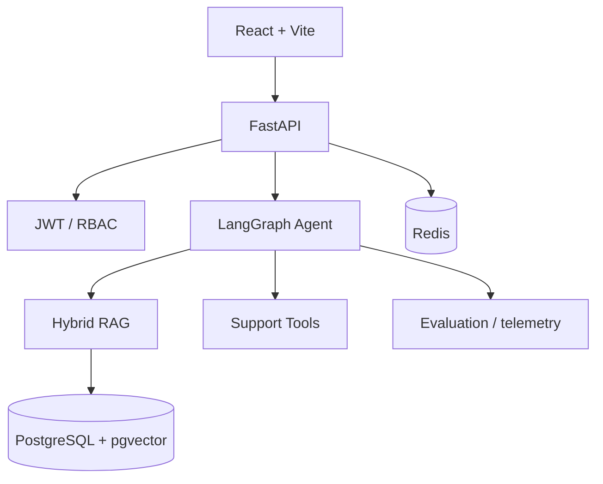

# Enterprise AI Support Agent

[](https://github.com/AloneRider-pixel/enterprise-ai-agent/actions/workflows/ci.yml)
[](https://github.com/AloneRider-pixel/enterprise-ai-agent/actions/workflows/codeql.yml)
[](LICENSE)

Production-oriented reference implementation for an enterprise AI support agent. It combines retrieval-augmented generation, LangGraph orchestration, authenticated APIs, document ingestion, memory, streaming, evaluation, and explicit safety boundaries.

## What the project demonstrates

- **Grounded RAG:** PDF/TXT/DOCX/Markdown ingestion, chunking, embeddings, hybrid retrieval, reranking, and citations.
- **Agent orchestration:** LangGraph state management with bounded tool execution for support workflows.
- **Security boundaries:** JWT authentication, role checks, rate limiting, prompt-injection defenses, bounded uploads, and owner-scoped resources.
- **Evaluation:** faithfulness, answer relevance, context recall, precision, latency, and cost instrumentation.
- **Delivery:** Dockerized PostgreSQL/pgvector, Redis, FastAPI, React/Vite, CodeQL, dependency review, and Scorecard.

## Architecture


```mermaid
graph TB
    UI[React + Vite] --> API[FastAPI]
    API --> AUTH[JWT / RBAC]
    API --> AGENT[LangGraph Agent]
    AGENT --> RAG[Hybrid RAG]
    AGENT --> TOOLS[Support Tools]
    RAG --> PG[(PostgreSQL + pgvector)]
    API --> REDIS[(Redis)]
    AGENT --> EVAL[Evaluation / telemetry]
```

The browser is a presentation layer. Authorization, provider credentials, persistence, and side-effect controls remain server-side.

## Stack

| Layer | Technology |
|---|---|
| Backend | Python 3.11, FastAPI, SQLAlchemy, asyncpg |
| AI | LangGraph, LangChain, OpenAI-compatible APIs |
| Retrieval | pgvector, BM25/full-text search, reranking |
| Data | PostgreSQL 16, Redis 7 |
| Frontend | React 18, Vite, Tailwind CSS |
| Auth | JWT / PyJWT |
| Delivery | Docker Compose, GitHub Actions |

## Repository map

```text
backend/
  app/agents/
  app/api/
  app/auth/
  app/middleware/
  app/rag/
  app/services/
  tests/
frontend/
evaluation/
scripts/
forgeai/
docs/
.github/workflows/
```

## Quick start

Prerequisites: Docker Compose.

```bash
git clone https://github.com/AloneRider-pixel/enterprise-ai-agent.git
cd enterprise-ai-agent
cp .env.example .env
docker compose up --build
```

Local services:

- Frontend: `http://localhost:3000`
- API: `http://localhost:8000`
- PostgreSQL: `localhost:5432`
- Redis: `localhost:6379`

Use only non-production credentials locally. Never commit secrets.

## Verification

Core backend checks:

```bash
cd backend
python -m ruff check app/ --select E,F --ignore E402,E501,F401,B008,S110
APP_ENV=test PYTHONPATH=. python -m pytest tests/ -v --tb=short --cov=app
```

Repository CI also validates the evaluation corpus, frontend build, and container images.

## Security model

Treat prompts, uploaded documents, retrieved text, model output, and tool arguments as untrusted inputs. Keep credentials server-side, enforce owner scoping, preserve authorization gates for side effects, and keep validation fail-closed.

See [SECURITY.md](SECURITY.md) and [docs/architecture.md](docs/architecture.md).

## Evaluation integrity

Checked-in evaluation fixtures provide reproducible engineering tests; they are not production benchmarks. Public quality or performance claims should include dataset, methodology, environment, sample count, and producing commit.

## Embedded ForgeAI

The [forgeai/](forgeai/) directory contains a bounded pull-request risk-analysis implementation used within this repository. Its policy decisions remain deterministic, with automation subject to explicit authorization.

See [ForgeAI README](forgeai/README.md).

## Documentation

- [Architecture](docs/architecture.md)
- [Engineering notes](docs/ENGINEERING_NOTES.md)
- [Security](SECURITY.md)
- [Contributing](CONTRIBUTING.md)

## Development standard

Keep dependency constraints compatible, pin workflow actions to immutable commits, preserve deterministic tests, and never weaken validation to manufacture a passing build.

## License

MIT
