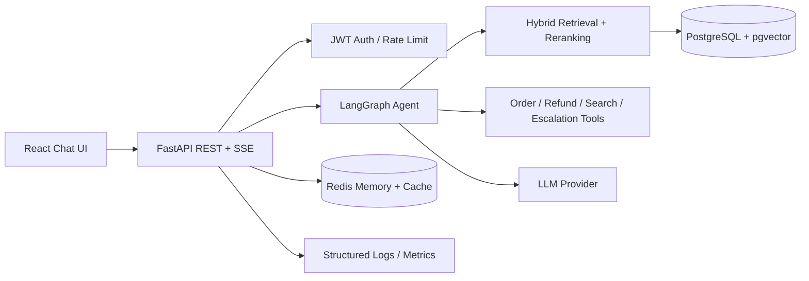

# Enterprise AI Agent Architecture

## Reliability and safety

- Retrieval responses retain source-document citations.
- Tool access is separated from free-form generation.
- Authentication and rate limiting protect application endpoints.
- External model calls remain observable through latency, token, and cost metrics.
- Evaluation covers faithfulness, relevance, recall, precision, latency, and cost.
